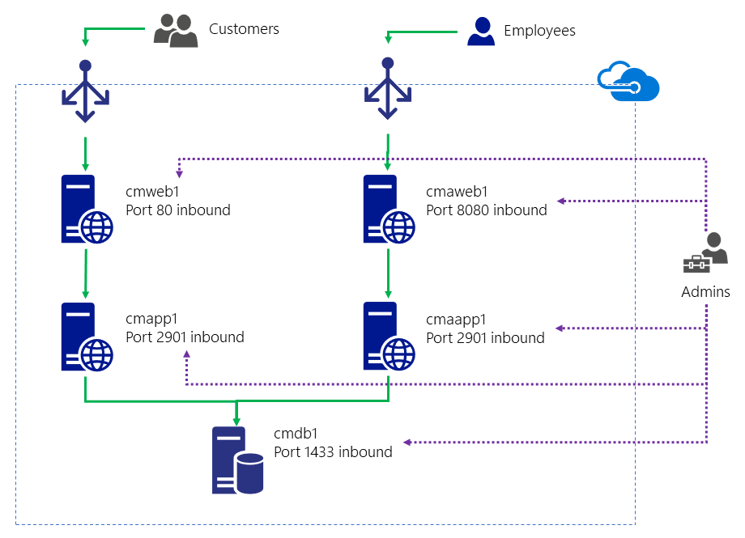

# Test migration

<table style="width: 100%; background-color: #243A5E; text-align: center">
<tr>
<td align="center"></td>
</tr>
</table>

## Reminders

* Use an InPrivate/Incognito window in your browser to avoid any confusion with any other credentials that you may use to access Azure resources.
* The credentials you need to access the Azure subscription assigned to your team are available on the *OpenHack Environment* tab.

## Challenge

The Director of IT wants to validate that the migration strategy is sound, and the migrated applications will not only be operational but also secure and compliant. Building this trust with the business is a key component of the migration to Azure. By validating not only your architecture but also your approach, you can make sure that the business is a partner in the move to the cloud.

This will require testing in isolation so that the existing on-premises environment is not impacted. This will allow the relevant teams at Contoso Mortgage to perform automated testing, offers application owners the opportunity to provide meaningful feedback, and allows for the migration to be performed as many times as it is needed to get it right.

In addition to maintaining their current segmentation, IT leadership would also like to introduce infrastructure to better position their applications for growth in the future. Moving to Azure will allow IaaS hosted applications to be more resilient by adopting features of the Azure platform that are only available in the cloud.

To position themselves for better resiliency for both the **Contoso Mortgage** and **Contoso Mortgage Admin** web applications, the Network Operations team would like to incorporate a load balancer into their architecture to allow for greater flexibility and elasticity in the front-end layer of their applications.

## Customer requirements

Contoso Mortgage has the following requirements which you should take into consideration:

* The migrated applications must maintain their segmentation at the network layer. For example, the customer-accessible web front-end for the **Contoso Mortgage** application can only communicate with the application server, and the application server can only communicate with the database server.
* The servers must be fully operational, including having the ability to access the servers using domain credentials without connectivity to any on-premises domain controllers.
* Due to security requirements, server administrators will not be able to use Remote Desktop over the public internet and no public IPs can be associated with Azure-hosted servers.
    * Members of the *CM Server Admins* security group should be granted rights to use any RDP or remote connectivity solution.
    * While administrators can connect across the previously established site-to-site connection, a solution must be implemented which does not rely on the presence of the site-to-site connection. Administrators must be able to connect if the connection is down or they are not working from their on-premises site.
* Each application must have a dedicated testing URL that can be distributed to testers.
* A load-balancing technology should be implemented for any user-facing servers (web front ends).

## Success Criteria

Present to your coach the applications **Contoso Mortgage** and **Contoso Mortgage Admin** in an isolated testing environment in Azure.

* Network segmentation is in place and limits lateral movement between application layers, including non-application communication such as RDP access.
* The URL you select for testing and validating each application needs to be resolvable from the public internet.
* Server administrators in the *CM Server Admins* security group can access all of the migrated servers in a secure manner which does not require opening RDP access to the public internet for any migrated servers.
* If **cmad1** is turned off or hybrid network connectivity between on-premises and Azure is lost, the applications in the isolated testing environment can still function.
* A load-balancing technology has been introduced in front of any user-facing web servers and the target applications remain functional.
* For any migrated servers, native Azure functionality such as the *Run Command* should be available as if the server was provisioned from the Azure Marketplace.

Your coach will discuss your implementation before you move on to the next challenge.

Before your team exits this challenge, be sure to clean up any testing resources which could impact your final migration.

## References

* <a href="https://docs.microsoft.com/azure/site-recovery/site-recovery-overview" target="_blank">About Site Recovery</a>
* <a href="https://docs.microsoft.com/azure/migrate/migrate-appliance" target="_blank">Azure Migrate appliance</a>
* <a href="https://docs.microsoft.com/azure/virtual-machines/troubleshooting/guest-os-firewall-blocking-inbound-traffic" target="_blank">Azure VM Guest OS firewall is blocking inbound traffic</a>
* <a href="https://docs.microsoft.com/azure/site-recovery/migrate-tutorial-windows-server-2008#limitations-and-known-issues" target="_blank">Migrate servers running Windows Server 2008 to Azure - Limitations and known issues</a>
* <a href="https://docs.microsoft.com/azure/migrate/migrate-replication-appliance" target="_blank">Replication appliance</a>
* <a href="https://docs.microsoft.com/azure/migrate/tutorial-migrate-hyper-v#run-a-test-migration" target="_blank">Run a test migration</a>
* <a href="https://docs.microsoft.com/azure/virtual-machines/windows/run-command" target="_blank">Run PowerShell scripts in your Windows VM with Run Command</a>
* <a href="https://blog.elmah.io/the-ultimate-guide-to-connection-strings-in-web-config/" target="_blank">The ultimate guide to connection strings in web.config</a>
* <a href="https://docs.microsoft.com/azure/dns/dns-overview" target="_blank">What is Azure DNS?</a>
* <a href="https://docs.microsoft.com/azure/load-balancer/load-balancer-overview" target="_blank">What is Azure Load Balancer?</a>
* <a href="https://docs.microsoft.com/previous-versions/windows/desktop/ics/windows-firewall-profiles" target="_blank">Windows Firewall Profiles</a>
